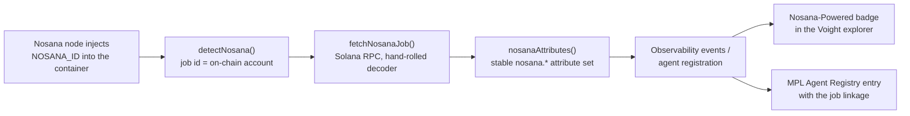

# Voight Nosana SDK

[](LICENSE)


**Detect, verify, and showcase AI agents running on [Nosana](https://nosana.com) decentralized GPU compute.**

When an agent runs on a Nosana GPU, its job is a real account on Solana. This SDK turns that fact into three capabilities, from inside the agent's own container:

1. **Detection**: know you are running on Nosana, and which job you are.
2. **On-chain correlation**: read your job account straight from Solana (state, GPU market, node, price, timings, IPFS artifacts) with no heavy dependencies.
3. **Verifiable identity**: emit stable `nosana.*` attributes that observability platforms and registries can trust, because every claim resolves on-chain.

Agents observed by [Voight](https://voight.xyz) that emit these attributes get a **Nosana-Powered badge** in the [public explorer](https://voight.xyz/explore) and an entry in the MPL Agent Registry.

## Install

```bash
npm install @voightxyz/nosana
```

Zero runtime dependencies. Ships ESM + CJS + TypeScript types. Node 18+.

## Quickstart

```ts
import { correlateNosana, nosanaAttributes } from '@voightxyz/nosana'

const nosana = await correlateNosana()
if (nosana) {
  console.log(nosana.context.jobId)  // on-chain job account (base58)
  console.log(nosana.job?.state)     // QUEUED | RUNNING | COMPLETED | STOPPED
  console.log(nosana.job?.market)    // GPU market address

  // Attach to your telemetry / agent registration:
  const attrs = nosanaAttributes(nosana)
  // { 'nosana.job_id': '…', 'nosana.state': 'RUNNING', 'nosana.market': '…', … }
}
```

Detection alone is synchronous and instant:

```ts
import { detectNosana, isRunningOnNosana } from '@voightxyz/nosana'

if (isRunningOnNosana()) {
  const { jobId, dashboardUrl } = detectNosana()!
  console.log(`Running as Nosana job ${jobId} → ${dashboardUrl}`)
}
```

## How the loop closes



Every hop is independently verifiable: the job id resolves on the [Nosana dashboard](https://dashboard.nosana.com) and any Solana explorer, and the IPFS CIDs decoded from the account resolve to the actual job definition and result.

## Proven live on mainnet

This is not a promise — the full loop has now run twice on real Nosana GPU jobs. The latest run (August 2, 2026, on an RTX 3060 node), every artifact public:

| Artifact | Reference |
| --- | --- |
| Nosana GPU job | [`4KQFyrvw6eGr2uRUvccR2UcG5ovAJW6ys6DuyUoifQw7`](https://dashboard.nosana.com/jobs/4KQFyrvw6eGr2uRUvccR2UcG5ovAJW6ys6DuyUoifQw7) — the job logs show the SDK detecting its own `NOSANA_ID` |
| Agent in the Voight explorer | [`voight.xyz/agent/cmsc4g119xw34clddokzlg1g2`](https://voight.xyz/agent/cmsc4g119xw34clddokzlg1g2) — **Agent Test Nosana**: Nosana-Powered badge, the Voight × Nosana card, and links back to the job and its registry entry |
| Ecosystem stats | [`api.voight.xyz/v1/stats`](https://api.voight.xyz/v1/stats) → `nosanaPowered` |
| MPL Agent Registry entry | [`7A3cNLx7WiJqGcXPKVsH5z4wVpCUTN2A63dPz9o9aGKK`](https://www.metaplex.com/agents/7A3cNLx7WiJqGcXPKVsH5z4wVpCUTN2A63dPz9o9aGKK) — minted on Solana mainnet with the Voight × Nosana card, `agent_uri` carries the job linkage |

Worth knowing: dashboard deployments pin only a logistics stub on IPFS (the runtime definition stays behind Nosana's deployment-manager), which is exactly why the SDK's active reporting is the reliable window into them — the [scanner](indexer/) counts these as *private deployments*.

Reproduce it yourself: the exact probe container lives in [`probe/`](probe/) (image [`seenfinity/nosana-agent-test`](https://hub.docker.com/r/seenfinity/nosana-agent-test)) — deploy it as a Nosana job and watch the chain fire. First acceptance run (July 22) and the full build log: [PROGRESS.md](PROGRESS.md).

## Framework support

The SDK is framework-agnostic by design: detection is one env read and correlation is one RPC call, so it works identically inside any agent runtime deployed on Nosana (ElizaOS, Hermes, OpenClaw, custom Node stacks). Two ways in:

- **Inside the agent** (any framework): the [`examples/`](examples/) boot beacon — one line in your start command, `VOIGHT_FRAMEWORK` tags the runtime.
- **Server-side** (no agent changes at all): the same `decodeJobAccount` powers the read-only [`indexer/`](indexer/) scanner, which discovers agents straight from the chain + IPFS and tells them apart from plain GPU infra.

How each framework is recognized from public data (image, command, and env signals — and the exact `VOIGHT_FRAMEWORK` override): see [**frameworks/**](frameworks/).

## API

### Detection

| Export | Signature | Notes |
| --- | --- | --- |
| `detectNosana` | `(env?) => NosanaContext \| null` | Reads `NOSANA_ID` (primary), `NOSANA_JOB_ID`, `JOB_ID`. Synchronous. |
| `isRunningOnNosana` | `(env?) => boolean` | Convenience predicate. |
| `nosanaJobUrl` | `(jobId) => string` | Nosana dashboard URL for a job. |

`NosanaContext`: `{ jobId, source, isAddress, dashboardUrl?, deploymentId? }`. The id is validated as a base58 Solana pubkey before any explorer link is produced; a malformed value still detects (the env var is the signal) but never renders a broken URL.

### On-chain

| Export | Signature | Notes |
| --- | --- | --- |
| `fetchNosanaJob` | `(jobId, opts?) => Promise<NosanaJobInfo \| null>` | Plain JSON-RPC `getAccountInfo` + local decode. `null` when the account doesn't exist. Throws on transport errors so callers can retry. |
| `decodeJobAccount` | `(address, bytes) => NosanaJobInfo` | Pure decoder, exposed for testing and indexers. |
| `NOSANA_JOBS_PROGRAM` | `const string` | `nosJhNRqr2bc9g1nfGDcXXTXvYUmxD4cVwy2pMWhrYM`, verified as the account owner on every fetch. |

`NosanaJobInfo` fields:

| Field | Meaning |
| --- | --- |
| `state` / `stateRaw` | `QUEUED` · `RUNNING` · `COMPLETED` · `STOPPED` · `UNKNOWN`. RUNNING is derived from a claimed (`timeStart > 0`), unfinished (`timeEnd == 0`) job. |
| `market` | GPU market account the job was posted to. |
| `node` | Node running the job. `null` while queued. |
| `payer` / `project` | Who paid and which project posted it. |
| `priceRaw` / `priceNos` | Job price (u64 raw, and in NOS at 6 decimals). |
| `timeStart` / `timeEnd` / `timeoutSeconds` | Unix seconds. `null` when not applicable yet. |
| `ipfsJobCid` / `ipfsResultCid` | CIDv0 reconstructed from the on-chain 32-byte digests. Result is `null` until posted. |
| `dashboardUrl` / `explorerUrl` | Nosana dashboard and Solscan links. |

### Correlation

| Export | Signature | Notes |
| --- | --- | --- |
| `correlateNosana` | `(opts?) => Promise<NosanaCorrelation \| null>` | Detection + chain read in one call. `null` off Nosana. Never throws on RPC hiccups: you always get the context, `job` may be `null`. |
| `nosanaAttributes` | `(correlation) => Record<string, string \| number>` | Flat, stable `nosana.*` keys ready to merge into telemetry events, registrations, or logs. |

Attribute keys: `nosana.job_id`, `nosana.source`, `nosana.deployment_id`, `nosana.dashboard_url`, `nosana.state`, `nosana.market`, `nosana.node`, `nosana.project`, `nosana.price_nos`, `nosana.started_at`, `nosana.ended_at`, `nosana.ipfs_job`, `nosana.ipfs_result`.

## Environment

| Variable | Role |
| --- | --- |
| `NOSANA_ID` | Injected by the Nosana node into every `container/run` operation. Its value is the on-chain job account address. Primary detection source. |
| `NOSANA_JOB_ID`, `JOB_ID` | Accepted fallbacks (gateway sidecar / explicit job definitions). |
| `DEPLOYMENT_ID` | Carried through when the job runs behind Nosana's load balancer. |
| `NOSANA_RPC_URL` / `SOLANA_RPC_URL` | Optional RPC override for `fetchNosanaJob` (defaults to the public mainnet RPC). |

Detection behavior is grounded in the [`nosana-ci/nosana-cli`](https://github.com/nosana-ci/nosana-cli) source (the container env merge in `Provider.ts`, and `jobHandler.claim()` setting the flow id to the claimed job address), and the account layout in [`nosana-ci/nosana-programs`](https://github.com/nosana-ci/nosana-programs) (`nosana-jobs/src/state.rs`).

## Voight platform integration

Agents observed by Voight that emit the `nosana.*` attributes get, automatically:

- A **"Nosana-Powered" badge** on their card and profile in the [public explorer](https://voight.xyz/explore), linked to the job dashboard for independent verification.
- A `nosanaPowered` counter in the ecosystem stats (`/v1/stats`) and a `nosana=true` filter on the agents API.
- Registration in the **MPL Agent Registry** (Metaplex) with a public `agent_uri` that carries the Nosana job linkage.

## Development

```bash
npm install
npm test        # node:test suite (detection + decode + correlation)
npm run build   # tsup → dist (ESM + CJS + d.ts)
```

Build log for this integration: [PROGRESS.md](PROGRESS.md).

## License

MIT © [Galaxyhub Labs Inc.](https://voight.xyz) d/b/a Voight
